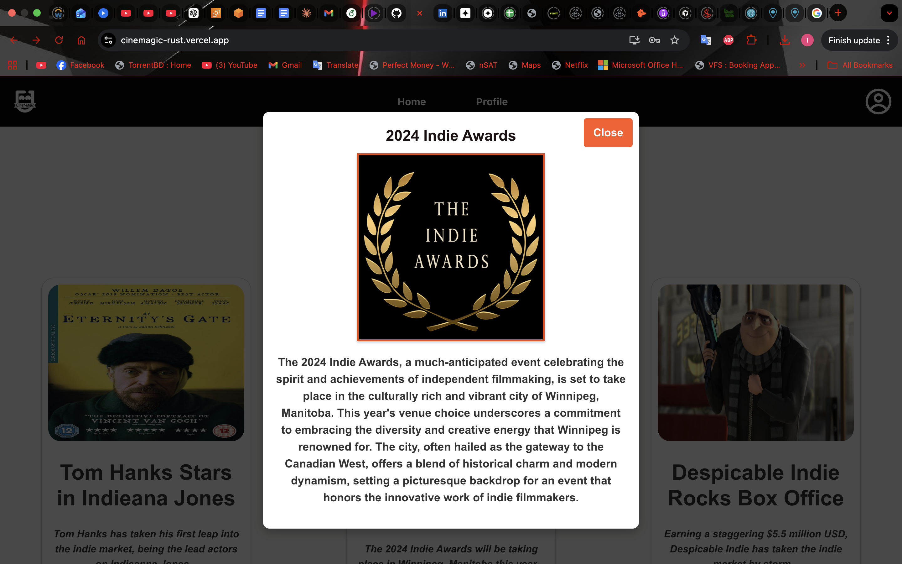
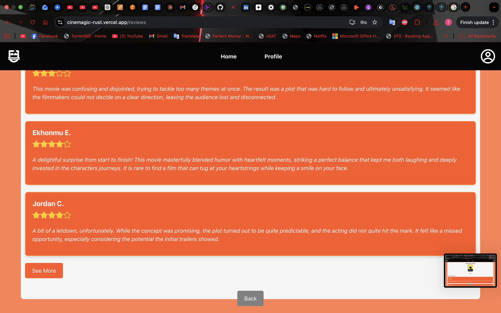

# 🎬 CineMagic — Indie Theatre Discovery & Ticket Booking Web App

> A purpose-built web application for Calgary's cherished independent theatre, CineMagic. Designed for indie film enthusiasts seeking a unique cinematic experience beyond the mainstream.


---

## 🌐 Live Demo

🔗 [cinemagic-rust.vercel.app](https://cinemagic-rust.vercel.app)

---

## 👥 Team — Tutorial 05, Group 03

| Name | Role |
|------|------|
| **Tanvir Ahamed Himel** | Frontend Developer — UI/UX Design (Figma), Interactive Components, React State Management |
| Viet Ho | Frontend Developer |
| Rohit Nair | Frontend Developer |
| Raj Chitodra | Frontend Developer |
| Ali Savab Pour | Frontend Developer |

> 📌 **My Contribution:** As the UI/Figma lead, I was responsible for designing the wireframes and high-fidelity prototypes in Figma before development began. I contributed to building interactive React components, implementing state management using React Hooks, and ensuring a consistent, responsive visual language across all pages of the application.

---

## 🛠️ Tech Stack


---

## ✨ Features Overview

| Feature | Description |
|---------|-------------|
| 🏠 Landing Page | Theatre intro, featured movies carousel, movie news |
| 🎥 Movie Listings | Browse currently airing indie films with ratings |
| 📰 Movie News | Latest news articles from the indie film world |
| 🎬 Movie Detail Page | Poster, description, trailer, reviews, showtimes |
| ⭐ User Reviews | Star ratings and verified user review system |
| 📅 Showtime Selection | Date picker + available showtime slots |
| 🎟️ Ticket Booking | Multi-category ticket selection with subtotal |
| 💺 Seat Selection | Interactive seat map with accessibility options |
| 💳 Payment & Checkout | Multiple payment methods + promo code support |
| 📧 Order Confirmation | QR code ticket, order summary, downloadable ticket |
| 👤 User Authentication | Sign up, log in, forgot password, reset password |
| 🔐 Password Validation | Secure password requirements with inline guidance |
| 👤 Profile Management | Edit name, email, phone, profile picture, payment method |
| 📜 Order History | Past bookings saved to user profile |

---

## 📸 Application Walkthrough

### 🏠 Homepage — Welcome to CineMagic
Calgary's cherished independent theatre, established in 2006. The homepage greets users with the theatre's story, a featured movies carousel, and the latest indie film news.


---

### 📰 Movie News — Stay Up to Date
Scroll down the homepage to discover the latest news articles from the indie film world. Click any article to read the full story in an interactive modal.



---

### 🎬 Movie Detail Page — Explore Before You Book
Clicking a movie takes you to a dedicated detail page with the poster, synopsis, runtime, and age rating. From here users can watch the trailer, read reviews, or proceed to showtimes.


---

### 🎥 Movie Selection — Browse Currently Airing Films
An easy-to-use carousel lets users browse currently showing indie films. Each card displays the movie poster, title, runtime, and age rating.


---

### ⭐ User Reviews — Community Ratings
Each movie has a dedicated reviews page showing an aggregate star rating and individual verified user reviews with scores out of 5.



---

### 🎟️ Ticket Selection — Choose Your Tickets
A clean ticket selection interface with categories for Adults, Children, and Seniors. Real-time subtotal updates as tickets are added. Includes a special assistance field for accessibility needs.


---

### 💺 Seat Selection — Interactive Seat Map
A comprehensive theatre seat layout showing available (green), unavailable (grey), and accessibility seats (blue). Users select seats matching their ticket count, with real-time validation.


---

### 💳 Payment & Checkout — Secure & Flexible
Users enter contact details and choose from Apple Pay, Google Pay, or Credit Card. A promo code field allows discounts to be applied. Logged-in users have their details pre-filled automatically.


---

### 📋 Order Confirmation — Review Before You Pay
A full order summary page displaying movie details, showtime, seat number, ticket breakdown, fees, and total price before final confirmation. Users receive a QR code ticket with their order number, downloadable directly.


---

### 🔘 Interactive UI — Buttons & Feature Components
Carefully designed interactive button components and UI elements built with React, ensuring a seamless and intuitive user experience throughout the booking flow.


---

### 👤 User Profile — Authentication & Account Management
Users can create a profile to save their information for faster future bookings. Secure login with email validation, password strength requirements, forgot password flow, and full profile management including order history.


---

## 🚀 Getting Started

### Prerequisites
- Node.js v14+
- npm or yarn

### Installation

```bash
# Clone the repository
git clone https://github.com/viet-ho/CineMagic.git

# Navigate to project directory
cd CineMagic

# Install dependencies
npm install

# Start the development server
npm start
```

The app will run at `http://localhost:3000`

---

## 📁 Project Structure

```
CineMagic/
├── public/
├── src/
│   ├── components/        # Reusable React components
│   ├── pages/             # Page-level components
│   │   ├── Home/
│   │   ├── MovieInfo/
│   │   ├── Reviews/
│   │   ├── DateSelection/
│   │   ├── TicketSelection/
│   │   ├── SeatBooking/
│   │   ├── Payment/
│   │   ├── CreditCard/
│   │   ├── ConfirmationPage/
│   │   └── Profile/
│   ├── App.js
│   └── index.js
└── package.json
```

---

## 🎯 Key Technical Highlights

- **Component-based architecture** — Modular React components for scalability and reusability
- **React Hooks** — `useState` and `useEffect` for dynamic UI updates and state management
- **React Router** — Multi-page navigation with clean URL routing
- **Form validation** — Real-time input validation with user-friendly error modals
- **Responsive design** — Consistent UI across desktop and mobile viewports
- **Accessibility** — Dedicated accessibility seat options and special assistance field in booking flow
- **Authentication flow** — Email/password auth with password reset via email link

---

## 📄 License

This project was developed as part of CPSC coursework at the **University of Calgary**.  
Team: Tutorial 05, Group 03 — Nov/Dec 2023

---

<p align="center">Made with ❤️ by the CineMagic Team — University of Calgary</p>
